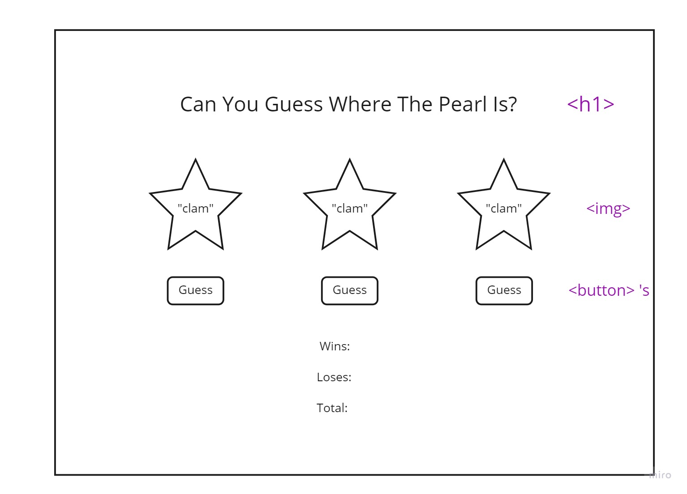

# Shell Game Plan

## HTML

-   h1 or h2 for header/intro to game

-   section for shells/buttons
-   img for shells
-   "guess" button

-   section for keeping records
-   div for Wins
-   div for Losses
-   div for Total

## EVENTS

-   button click "submit guess"
-   set option chosen as selected guess
